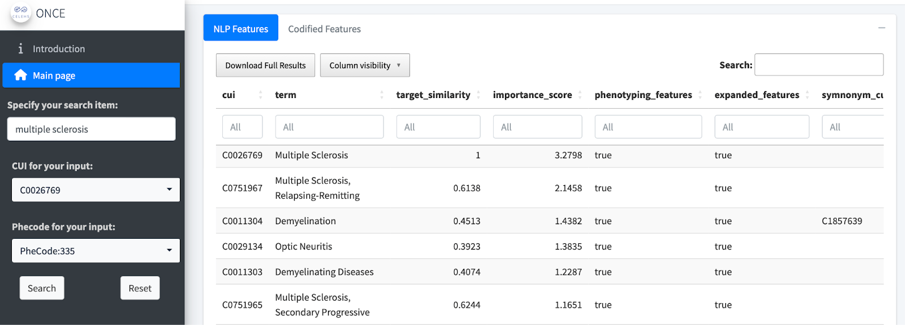
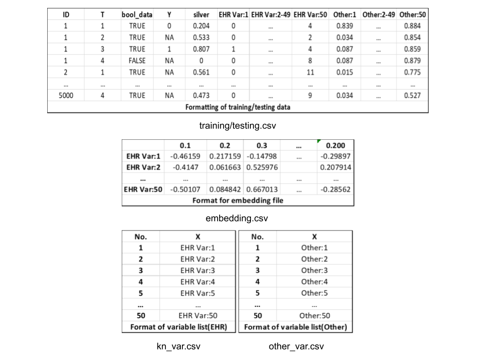
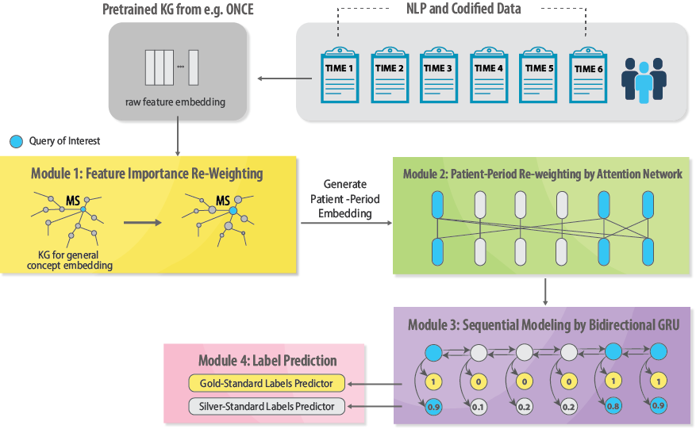

# **Deriving and Calibrating Longitudinal Outcome from Electronic Health Records**

This repository is a summary of all the resources and tools that includes in this tutorial: Deriving and Calibrating Longitudinal Outcome from Electronic Health Records.

## Contents

## Description and flowchart

1.  **Data curation:** including data standardization, variable selection by knowledge graph and cohort construction

2.  **Phenotyping Longitudinal Disease Progression Outcome:**

    (1) Data Preparation

    (2) Training the Label-efficient Phenotyping Algorithm (LATTE)

    (3) Ensemble Learning

3.  **Calibrating Causal Analysis with Real-World Evidence**

    (1) Deriving Baseline Covariates and Disease Progression Outcome from EHR Data

    (2) Calibrating Outcomes for Unbiased ATE Estimation

## Method

### Step 1: Data curation

#### Data Standardization

##### - Aggregating codified data

Aggregating codified data Raw EHR concepts are aggregated to higher level concepts.

| Use                      | Method | Links                                                                                                                                                                                                                                                                                                                                                                                                                                                                                                                                                                                                                                                                             | References                                                                                                                                                             |
|------------------|------------------|------------------|------------------|
| Aggregating EHR concepts | PheWAS | [PheWAS](https://phewascatalog.org/) , [Phecode Map 1.2 with ICD-9 Codes](https://phewascatalog.org/phecodes) , [Phecode Map 1.2 with ICD-10cm Codes (beta)](https://phewascatalog.org/phecodes_icd10cm)                                                                                                                                                                                                                                                                                                                                                                                                                                                                          | [PheWAS: demonstrating the feasibility of a phenome-wide scan to discover gene–disease associations](https://academic.oup.com/bioinformatics/article/26/9/1205/201211) |
| Aggregating EHR concepts | CCS    | [ICD-9-CM Diagnosis and Procedure Codes: Abbreviated and Full Code Titles](https://www.cms.gov/medicare/coding-billing/icd-10-codes/icd-9-cm-diagnosis-procedure-codes-abbreviated-and-full-code-titles) , [2024 ICD-10-PCS](https://www.cms.gov/medicare/coding-billing/icd-10-codes/2024-icd-10-pcs) , [List of CPT/HCPCS Codes](https://www.cms.gov/medicare/regulations-guidance/physician-self-referral/list-cpt-hcpcs-codes) , [Clinical Classifications Software (CCS) for ICD-9-CM](https://hcup-us.ahrq.gov/toolssoftware/ccs/ccs.jsp) , [Clinical Classifications Software (CCS) for ICD-10-PCS (beta version)](https://hcup-us.ahrq.gov/toolssoftware/ccs10/ccs10.jsp) | [Hospital Inpatient Statistics, 1995](https://hcup-us.ahrq.gov/reports/natstats/his95/clinclas.htm)                                                                    |
| Aggregating EHR concepts | LOINC  | [Download LOINC](https://loinc.org/downloads/)                                                                                                                                                                                                                                                                                                                                                                                                                                                                                                                                                                                                                                    | [LOINC, a universal standard for identifying laboratory observations: a 5-year update](https://pubmed.ncbi.nlm.nih.gov/12651816/)                                      |
| Aggregating EHR concepts | RxNorm | [RxNorm Files](https://www.nlm.nih.gov/research/umls/rxnorm/docs/rxnormfiles.html)                                                                                                                                                                                                                                                                                                                                                                                                                                                                                                                                                                                                | [RxNorm: Prescription for Electronic Drug Information Exchange](https://github.com/SHENRMARKDOWN/Protocol-for-deriving-longitudinal-Clinical-Outcomes-from-electronic-health-records/blob/main/Reference_files/RxNorm.pdf)                                                                                                                                                                    |

This is a visualization tool for aggregating codified data.

| Use                                          | Method                             | Links                                                                             |
|-----------------------|------------------|-------------------------------|
| Visualizing the aggregation of codified data | ICD, LOINC, and RxNorm Hierarchies | [ICD, LOINC, and RxNorm Hierarchies](https://shiny.parse-health.org/hierarchies/) |

##### - Processing narrative data

We will extract the NLP mentions from the free-text clinical notes and map them into the Concept Unique Identifiers (CUIs) in the Unified Medical Language System (UMLS).

| Use                       | Method                                         | Links                                                     | References                                                                                                                                                                                                                                                        |
|------------------|------------------|------------------|-------------------|
| Processing narrative data | Narrative Information Linear Extraction (NILE) | [NILE](https://celehs.hms.harvard.edu/software/NILE.html) | [The UMLS project: making the conceptual connection between users and the information they need.](https://www.ncbi.nlm.nih.gov/pmc/articles/PMC225759/) , [NILE: Fast Natural Language Processing for Electronic Health Records](https://arxiv.org/abs/1311.6063) |

##### - Summarizing

The result of the codified data aggregation and narrative data processing will be aggregated longitudinally into monthly counts for each patient from the onset time.

#### Variable Selection by Knowledge Graph

Given the vast number of variables (both codified and narrative) present in EHRs, implementing an effective filtering strategy is essential to control storage and computation costs while also safeguarding patient privacy in accordance with the standard for minimum necessary uses. The Shiny app web service called ONCE offers a searchable knowledge network, accessible at [*https://shiny.parse-health.org/ONCE/*](https://shiny.parse-health.org/ONCE/){.uri}*.* Users can enter the name of the disease of interest under “Specify Your Search Item” and download the variable dictionaries by selecting “Download Full Results” under “NLP Features” and “Codified Features.” Below is an example search using "multiple sclerosis" as the search item.

| Use                           | Method | Links                                         | References                                                                                                                       |
|------------------|------------------|------------------|-------------------|
| Compiling Variable Dictionary | ONCE   | [ONCE](https://shiny.parse-health.org/ONCE/#) | [Knowledge-Driven Online Multimodal Automated Phenotyping System](https://www.medrxiv.org/content/10.1101/2023.09.29.23296239v1) |

#### Cohort Construction

We are going to use high-throughput **M**ultimodal **A**utomated **P**henotyping **(MAP)** algorithm to complete the phenotyping. MAP is a algorithm used to predict the probability of the patient having a certain outcome (eg: target disease) based on the counts of ICD codes, NLP mentions, and visits. The MAP will automatically generate a threshold based on the data. The details of MAP can be found in [High-throughput multimodal automated phenotyping (MAP) with application to PheWAS](https://academic.oup.com/jamia/article-abstract/26/11/1255/5544731)

| Use         | Method                                                | Links                           | References                                                                                                                                              |
|------------------|------------------|------------------|-------------------|
| Phenotyping | MAP(high-throughput Multimodal Automated Phenotyping) | "MAP" package is available in R | [High-throughput multimodal automated phenotyping (MAP) with application to PheWAS](https://academic.oup.com/jamia/article-abstract/26/11/1255/5544731) |

##### - Code directory

| Name | Description                            | Links                                                                                                                                                                                  |
|-------------------|----------------------------------|-------------------|
| MAP  | An example of how to run MAP algorithm | [map_example.R](https://github.com/SHENRMARKDOWN/Protocol-for-deriving-longitudinal-Clinical-Outcomes-from-electronic-health-records/tree/main/Code/step1_disease_cohort_construction) |

### Step 2: Phenotyping Longitudinal Disease Progression Outcome

#### Data Preparation

##### - Obtaining Gold-standard Labels

Gold-standard labels are critical for accurate modeling and should be collected longitudinally for at least 200 patients to ensure robust algorithm training and validation. These labels can be sourced from disease registries or through meticulous manual chart reviews. For patient-periods where gold-standard labels are unavailable, they should be marked as ‘NA’ to indicate missingness.

##### - Knowledge-Guided Feature Selection and Aggregation

The ONCE provides a “importance score” metric, selection will be based on this metric. We recommend to set the threshold as 0.1 and keep those exceed 0.1. The processing of feature selection can also be combined with medical experts review or opinion.

| Use               | Method | Links                                        | Reference                                                                                                                        |
|------------------|------------------|------------------|-------------------|
| Feature selection | ONCE   | [ONCE](https://shiny.parse-health.org/ONCE/) | [Knowledge-Driven Online Multimodal Automated Phenotyping System](https://www.medrxiv.org/content/10.1101/2023.09.29.23296239v1) |

##### - Obtaining Silver-standard Labels

LATTE’s label-efficient approach utilizes predictive silver-standard labels to effectively train models on large, unlabeled datasets. These silver-standard labels for each patient-period can be generated through various methods: by aggregating diagnosis codes most relevant to the outcome of interest, employing advanced NLP or AI tools to extract information about disease progression from narrative notes, or using specific EHR variables—such as particular diagnoses or treatments—as proxies for adverse outcomes. For more complex outcomes, such as disability or remission, a list of related clinical conditions can first be identified, after which the ONCE tool can be used to iteratively search, compile, and combine relevant features with importance score \>0.1. With these features in hand, a supervised pre-training model such as random forest or XGBoost can be developed using a small subset of labeled data to aggregate predictive information. The predicted probabilities generated from this model can serve as the silver-standard labels.

| Use                            | Method                                                       | Links                                                                     | Reference                                                                                                                                                                                                                                                                                                                                                                              |
|-------------------|------------------|------------------|------------------|
| Creating silver-standard label | Diagnosis code counts                                        | NA                                                                        | [LATTE: Label-efficient incident phenotyping from longitudinal electronic health records](https://www.cell.com/patterns/fulltext/S2666-3899(23)00313-6) , [A semi-supervised adaptive Markov Gaussian embedding process (SAMGEP) for prediction of phenotype event times using the electronic health record](https://www.nature.com/articles/s41598-022-22585-3)                       |
| Creating silver-standard label | NLP processing: NLP Interpreter for Cancer Extraction (NICE) | NA                                                                        | [Performance of a Machine Learning Algorithm Using Electronic Health Record Data to Identify and Estimate Survival in a Longitudinal Cohort of Patients With Lung Cancer](https://jamanetwork.com/journals/jamanetworkopen/article-abstract/2781685)                                                                                                                                   |
| Creating silver-standard label | NLP processing: NLP pipeline                                 | [RISE_PROS](https://github.com/mhdroz/RISE_PROS?tab=MIT-1-ov-file#readme) | [Development of a Natural Language Processing System for Extracting Rheumatoid Arthritis Outcomes From Clinical Notes Using the National Rheumatology Informatics System for Effectiveness Registry](https://acrjournals.onlinelibrary.wiley.com/doi/abs/10.1002/acr.24869?casa_token=qBHRelp_VTcAAAAA%3AMzpKqHU2T8Fuzj6GI7mv4bWQE9jqWDzF9E2zIf15mVKCAzZVr6Ixu5jCZqGKxnPvDe84L2Zj2ft0) |
| Creating silver-standard label | NLP processing: NLP pipeline                                 | NA                                                                        | [Classification of neurologic outcomes from medical notes using natural language processing](https://www.sciencedirect.com/science/article/pii/S0957417422021893)                                                                                                                                                                                                                      |
| Creating silver-standard label | ONCE+supervised models on the labeled dataset                | NA                                                                        | NA                                                                                                                                                                                                                                                                                                                                                                                     |

##### - Organizing the Input Data

Format all the data we gain in the previous steps into below files :

| File           | Name          | Component                                                                                                                                                                                        |
|---------------------------|--------------------------|-------------------|
| training data  | train.csv     | **Col:** “ID” – patient number, “T” – period, “bool_data” – follow-up indicator, “Y” – gold-standard labels on target clinical outcomes, “silver” – silver standard labels **Row:** Observations |
| testing data   | test.csv      | Same as training data                                                                                                                                                                            |
| embedding      | embedding.csv | **Col:** Dimension **Row:** EHR Variable                                                                                                                                                         |
| variable lists | kn_var.csv    | **Col:**"No." - Number "X" - Description **Row:** EHR Variable                                                                                                                                   |
| variable lists | other_var.csv | **Col:**"No." - Number "X"- Description **Row:** Other variable                                                                                                                                  |

TO ADD: format all csvs into a nicer style and input them according to order here. The following picture shows an example of formatted LATTE input files. 

#### Training the Label-efficient Phenotyping Algorithm (LATTE)

The following pictures shows a brief description of the pipeline of LATTE.

| Name            | Description                                                        | Links                                                                                                                                                                                  | References |
|------------------|------------------|------------------|-------------------|
| LATTE           | An explanation of LATTE                                            | NA                                                                                                                                                                                     | TBD        |
| Data generation | A detailed explanation of generating data(for simulation) in LATTE | NA                                                                                                                                                                                     | TBD        |
| Main program    | The R codes of LATTE                                               | [Main](https://github.com/SHENRMARKDOWN/Protocol-for-deriving-longitudinal-Clinical-Outcomes-from-electronic-health-records/blob/main/LATTE_files/main.R)                              | TBD        |
| Functions       | The functions invovle in the main program                          | [Functions](https://github.com/SHENRMARKDOWN/Protocol-for-deriving-longitudinal-Clinical-Outcomes-from-electronic-health-records/blob/main/LATTE_files/simulation_data_functions_v4.R) | TBD        |
| Getting folders | The R code to get folders for LATTE                                | [Get fold](https://github.com/SHENRMARKDOWN/Protocol-for-deriving-longitudinal-Clinical-Outcomes-from-electronic-health-records/blob/main/LATTE_files/get_Folds.R)                     | TBD        |

#### Ensemble Learning

To enhance prediction accuracy, LATTE's imputed disease progression outcomes can be combined with those derived from other machine learning models. Some machine learning methods are listed below:

| Use                                    | Method        | Links | Reference                                                                                                                                                                                                                                                                                                                                                |
|------------------|------------------|------------------|------------------|
| Standard (supervised) machine learning | LASSO         | NA    | [Regression Shrinkage and Selection Via the Lasso](https://academic.oup.com/jrsssb/article/58/1/267/7027929) , [The Adaptive Lasso and Its Oracle Properties](https://www-tandfonline-com.ezp3.lib.umn.edu/doi/abs/10.1198/016214506000000735?casa_token=qK9SrbgcCEgAAAAA%3A-k4kYOp8v-ElzBcolgMwpCoTUymINXwn4TvXCYS8T7k3KH9p4NDhbIxnG5lei6oucsmyt-qtvQ&) |
| Standard (supervised) machine learning | Random Forest | NA    | [Random Forests](https://link.springer.com/article/10.1023/a:1010933404324)                                                                                                                                                                                                                                                                              |
| Standard (supervised) machine learning | Boosting      | NA    | [The strength of weak learnability](https://link.springer.com/article/10.1007/bf00116037) , [XGBoost: A Scalable Tree Boosting System](https://dl.acm.org/doi/abs/10.1145/2939672.2939785)                                                                                                                                                               |

TO ADD: directory to the codes: Code/step2_phenotype_longitudinal_disease_progression_outcome/ensemble/example_ensemble.

##### - Code directory

| Name                   | Description                                                                                       | Links                                                                                                                                                                                                                                                                                                                                                                                                                                                                                                       |
|------------------|------------------------------------|------------------|
| LATTE                  | Transformer, preprocessing, semi-mode, input arguments, main codes, test and utilization of LATTE | [LATTE](https://github.com/SHENRMARKDOWN/Protocol-for-deriving-longitudinal-Clinical-Outcomes-from-electronic-health-records/tree/main/Code/step2_phenotype_longitudinal_disease_progression_outcome/LATTE)                                                                                                                                                                                                                                                                                                 |
| Ensemble               | An example of ensemble                                                                            | [example_ensemble.R](https://github.com/SHENRMARKDOWN/Protocol-for-deriving-longitudinal-Clinical-Outcomes-from-electronic-health-records/tree/main/Code/step2_phenotype_longitudinal_disease_progression_outcome/ensemble)                                                                                                                                                                                                                                                                                 |
| Other supervised model | An example of other supervised models                                                             | [example_run.R](https://github.com/SHENRMARKDOWN/Protocol-for-deriving-longitudinal-Clinical-Outcomes-from-electronic-health-records/tree/main/Code/step2_phenotype_longitudinal_disease_progression_outcome/other_supervised_models)                                                                                                                                                                                                                                                                       |
| Simulation data        | Simulation                                                                                        | [Simulation data generation](https://github.com/SHENRMARKDOWN/Protocol-for-deriving-longitudinal-Clinical-Outcomes-from-electronic-health-records/tree/main/Code/step2_phenotype_longitudinal_disease_progression_outcome/simulated_input_data/simulated_data_generation) , [Simulation](https://github.com/SHENRMARKDOWN/Protocol-for-deriving-longitudinal-Clinical-Outcomes-from-electronic-health-records/tree/main/Code/step2_phenotype_longitudinal_disease_progression_outcome/simulated_input_data) |

### Step 3: **Calibrating Causal Analysis with Real-World Evidence**

#### **Deriving Baseline Covariates and Disease Progression Outcome from EHR Data**

To prepare for a causal analysis, the following key components need to be specified beforehand:

-   Eligibility criteria,
-   Treatment arm selection,
-   Period of evaluation, and
-   List of potential baseline confounders.

However, it is worth noting that certain important baseline confounders, such as baseline disease progression outcomes, may be missing in the EHR and hence needs to be imputed beforehand. LATTE and the ensemble methods introduced in the previous step can be leveraged to do the imputation.

#### **Calibrating Outcomes for Unbiased ATE Estimation**

Several calibration methods exist for causal analysis. Here, we focus on the method proposed by Cheng et al. [32], which includes the following steps:

-   Fitting a Double-Index Propensity Score (PS) Model
-   Calculating the Utility Covariate
-   Outcome Calibration
-   ATE Estimation

TO ADD: directory to the codes: Code/step3_causal_calibration/example_calibration.R

##### - Code directory

| Name               | Description               | Link                                                                                                                                                                                  |
|-----------------|--------------------------------------|-----------------|
| Causal calibration | An example of calibration | [example_calibration.R](https://github.com/SHENRMARKDOWN/Protocol-for-deriving-longitudinal-Clinical-Outcomes-from-electronic-health-records/tree/main/Code/step3_causal_calibration) |
