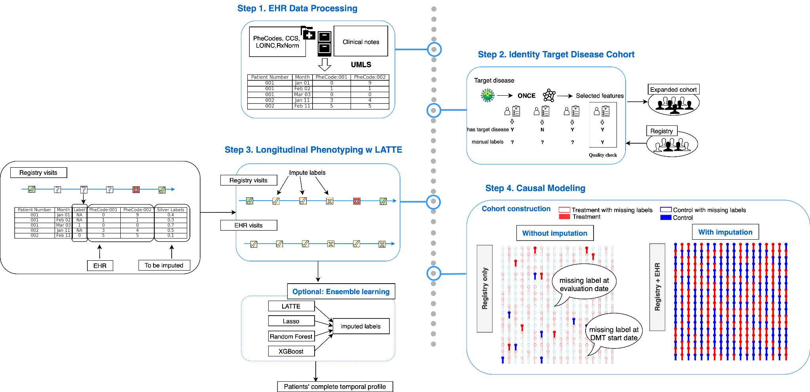
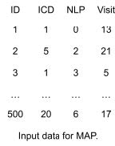
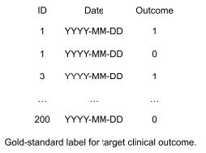
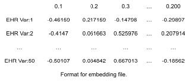
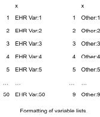

# Protocol-for-deriving-longitudinal-Clinical-Outcomes-from-electronic-health-records

This repository is a summary of all the resources and tools that includes in this protocol: Protocol for deriving longitudinal Clinical Outcomes from electronic health records.

## Contents

## Description and flowchart

In this protocol, we are going to present a method to capture longitudinal clinical outcomes from structured and unstructured electronic health record based on the the high-throughput **M**ultimodal **A**utomated **P**henotyping **(MAP)** algorithm and **LA**bel efficien**T** inciden**T** ph**E**notyping **(LATTE)** algorithm . The result, which is the qualified clinical outcomes can be used to harness electronic health data to real-world data. The protocol is generally made up by 4 steps:

1)  Creating EHR Data mart;
2)  Selecting codified and narrative features with ONCE, compiling and performing the MAP algorithm;
3)  Preparing data for LATTE algorithm;
4)  Performing the LATTE to get longitudinal outcome.

## Method

### Step 1: Creating EHR Data mart

The EHR Data mart is the basic component of the protocol, it consists both the codified data and narrative data.

##### Compiling Variable Dictionary

The raw EHR data includes a great amount of information, and many of them do not need to be involve in our study taken both confidentiality and storage availability under consideration. We need a variable dictionary for our specific study on the target disease. The shiny app ONCE can help us derive the relative codified features(PheCode, CCS, LOINC, RxNorm) and narrative features(relative CUIs and terms) .

| Use                           | Method | Links                                         | References                                                                                                                       |
|------------------|------------------|------------------|-------------------|
| Compiling Variable Dictionary | ONCE   | [ONCE](https://shiny.parse-health.org/ONCE/#) | [Knowledge-Driven Online Multimodal Automated Phenotyping System](https://www.medrxiv.org/content/10.1101/2023.09.29.23296239v1) |

##### Aggregating codified data

Aggregating codified data Raw EHR concepts are aggregated to higher level concepts.

| Use                      | Method | Links                                                                                                                                                                                                                                                                                                                                                                                                                                                                                                                                                                                                                                                                             | References                                                                                                                                                             |
|------------------|------------------|------------------|------------------|
| Aggregating EHR concepts | PheWAS | [PheWAS](https://phewascatalog.org/) , [Phecode Map 1.2 with ICD-9 Codes](https://phewascatalog.org/phecodes) , [Phecode Map 1.2 with ICD-10cm Codes (beta)](https://phewascatalog.org/phecodes_icd10cm)                                                                                                                                                                                                                                                                                                                                                                                                                                                                          | [PheWAS: demonstrating the feasibility of a phenome-wide scan to discover gene–disease associations](https://academic.oup.com/bioinformatics/article/26/9/1205/201211) |
| Aggregating EHR concepts | CCS    | [ICD-9-CM Diagnosis and Procedure Codes: Abbreviated and Full Code Titles](https://www.cms.gov/medicare/coding-billing/icd-10-codes/icd-9-cm-diagnosis-procedure-codes-abbreviated-and-full-code-titles) , [2024 ICD-10-PCS](https://www.cms.gov/medicare/coding-billing/icd-10-codes/2024-icd-10-pcs) , [List of CPT/HCPCS Codes](https://www.cms.gov/medicare/regulations-guidance/physician-self-referral/list-cpt-hcpcs-codes) , [Clinical Classifications Software (CCS) for ICD-9-CM](https://hcup-us.ahrq.gov/toolssoftware/ccs/ccs.jsp) , [Clinical Classifications Software (CCS) for ICD-10-PCS (beta version)](https://hcup-us.ahrq.gov/toolssoftware/ccs10/ccs10.jsp) | [Hospital Inpatient Statistics, 1995](https://hcup-us.ahrq.gov/reports/natstats/his95/clinclas.htm)                                                                    |
| Aggregating EHR concepts | LOINC  | [Download LOINC](https://loinc.org/downloads/)                                                                                                                                                                                                                                                                                                                                                                                                                                                                                                                                                                                                                                    | [LOINC, a universal standard for identifying laboratory observations: a 5-year update](https://pubmed.ncbi.nlm.nih.gov/12651816/)                                      |
| Aggregating EHR concepts | RxNorm | [RxNorm Files](https://www.nlm.nih.gov/research/umls/rxnorm/docs/rxnormfiles.html)                                                                                                                                                                                                                                                                                                                                                                                                                                                                                                                                                                                                | TBD                                                                                                                                                                    |

This is a visualization tool for aggregating codified data.

| Use                                          | Method                             | Links                                                                             |
|------------------------------|------------------------|------------------|
| Visualizing the aggregation of codified data | ICD, LOINC, and RxNorm Hierarchies | [ICD, LOINC, and RxNorm Hierarchies](https://shiny.parse-health.org/hierarchies/) |

##### Processing narrative data

We will extract the NLP mentions from the free-text clinical notes and map them into the Concept Unique Identifiers (CUIs) in the Unified Medical Language System (UMLS).

| Use                       | Method                                         | Links                                                     | References                                                                                                                                                                                                                                                        |
|------------------|-------------------|------------------|------------------|
| Processing narrative data | Narrative Information Linear Extraction (NILE) | [NILE](https://celehs.hms.harvard.edu/software/NILE.html) | [The UMLS project: making the conceptual connection between users and the information they need.](https://www.ncbi.nlm.nih.gov/pmc/articles/PMC225759/) , [NILE: Fast Natural Language Processing for Electronic Health Records](https://arxiv.org/abs/1311.6063) |

##### Summarizing

The result of the codified data aggregation and narrative data processing will be aggregated longitudinally into monthly counts for each patient from the onset time.

## Step 2: Phenotyping

We are going to use high-throughput **M**ultimodal **A**utomated **P**henotyping **(MAP)** algorithm to complete the phenotyping. MAP is a algorithm used to predict the probability of the patient having a certain outcome (eg: target disease) based on the counts of ICD codes, NLP mentions, and visits. The MAP will automatically generate a threshold based on the data. The details of MAP can be found in [High-throughput multimodal automated phenotyping (MAP) with application to PheWAS](https://academic.oup.com/jamia/article-abstract/26/11/1255/5544731)

| Use         | Method                                                | Links                           | References                                                                                                                                              |
|------------------|------------------|------------------|-------------------|
| Phenotyping | MAP(high-throughput Multimodal Automated Phenotyping) | "MAP" package is available in R | [High-throughput multimodal automated phenotyping (MAP) with application to PheWAS](https://academic.oup.com/jamia/article-abstract/26/11/1255/5544731) |

## Step 3: Preparing data for LATTE algorithm

##### Creating Golden-standard label

LATTE needs both golden-label and silver-label in order to train the algorithm. At least 200 golden labels are recommended and they can be derived by existing data source (eg: disease registries, manual chart review) .

##### Creating Silver-standard label

Silver standard labels can be constructed for each patient-period according to frequency of assessment determined in EHR data processing section.

| Use                            | Method                 | Links                                                                                                                                                                                                                                                                                                                                                                                  |
|---------------------------|------------------|---------------------------|
| Creating silver-standard label | Diagnosis code counts  | [LATTE: Label-efficient incident phenotyping from longitudinal electronic health records](https://www.cell.com/patterns/fulltext/S2666-3899(23)00313-6) , [A semi-supervised adaptive Markov Gaussian embedding process (SAMGEP) for prediction of phenotype event times using the electronic health record](https://www.nature.com/articles/s41598-022-22585-3)                       |
| Creating silver-standard label |                        | [Performance of a Machine Learning Algorithm Using Electronic Health Record Data to Identify and Estimate Survival in a Longitudinal Cohort of Patients With Lung Cancer](https://jamanetwork.com/journals/jamanetworkopen/article-abstract/2781685)                                                                                                                                   |
| Creating silver-standard label |                        | [Development of a Natural Language Processing System for Extracting Rheumatoid Arthritis Outcomes From Clinical Notes Using the National Rheumatology Informatics System for Effectiveness Registry](https://acrjournals.onlinelibrary.wiley.com/doi/abs/10.1002/acr.24869?casa_token=qBHRelp_VTcAAAAA%3AMzpKqHU2T8Fuzj6GI7mv4bWQE9jqWDzF9E2zIf15mVKCAzZVr6Ixu5jCZqGKxnPvDe84L2Zj2ft0) |
| Creating silver-standard label |                        | [Classification of neurologic outcomes from medical notes using natural language processing](https://www.sciencedirect.com/science/article/pii/S0957417422021893)                                                                                                                                                                                                                      |
| Creating silver-standard label | Medical experts review |                                                                                                                                                                                                                                                                                                                                                                                        |

##### Feature selection

The ONCE provides a “importance score” metric, selection will be based on this metric. We recommend to set the threshold as 0.1 and keep those exceed 0.1. The processing of feature selection can also be combined with medical experts review or opinion.

| Use               | Method | Links                                        | Reference                                                                                                                        |
|------------------|------------------|------------------|-------------------|
| Feature selection | ONCE   | [ONCE](https://shiny.parse-health.org/ONCE/) | [Knowledge-Driven Online Multimodal Automated Phenotyping System](https://www.medrxiv.org/content/10.1101/2023.09.29.23296239v1) |

##### Formatting the input data

Format all the data we gain in the previous steps into below files :

| File           | Name          | Component                                                                                                                                                                                |
|---------------------------|--------------------------|-------------------|
| training data  | train.csv     | “ID” – patient number, “T” – period, “bool_data” – follow-up indicator, “Y” – gold-standard labels on target clinical outcomes, “silver” – silver standard labels, K = maximal follow-up |
| testing data   | test.csv      | Same as training data                                                                                                                                                                    |
| embedding      | embedding.csv | TBD                                                                                                                                                                                      |
| variable lists | kn_var.csv    | TBD                                                                                                                                                                                      |
| variable lists | other_var.csv | TBD                                                                                                                                                                                      |

